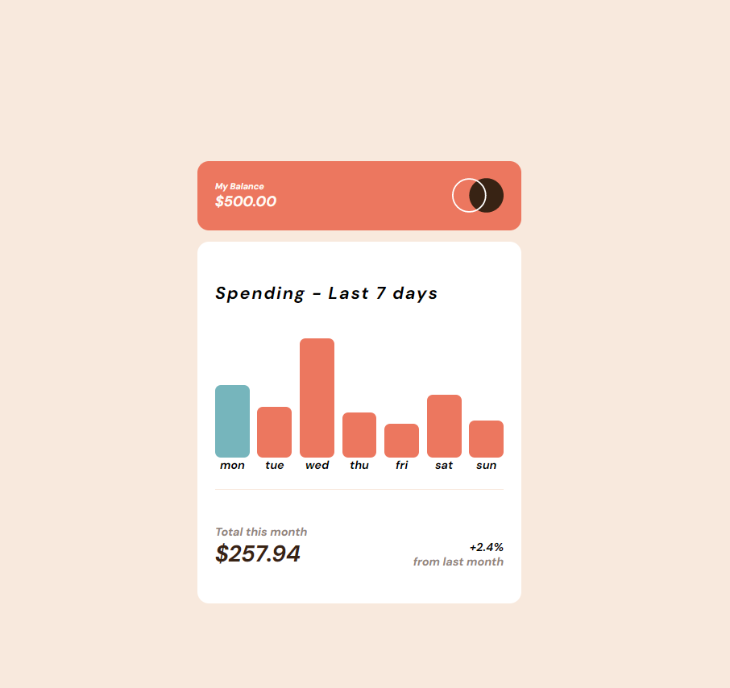

# Frontend Mentor - Expenses chart component solution

This is a solution to the [Expenses chart component challenge on Frontend Mentor](https://www.frontendmentor.io/challenges/expenses-chart-component-e7yJBUdjwt). Frontend Mentor challenges help you improve your coding skills by building realistic projects. 

## Table of contents

- [Overview](#overview)
  - [The challenge](#the-challenge)
  - [Screenshot](#screenshot)
  - [Links](#links)
- [My process](#my-process)
  - [Built with](#built-with)
  - [What I learned](#what-i-learned)
  - [Continued development](#continued-development)
  - [Useful resources](#useful-resources)
- [Author](#author)
- [Acknowledgments](#acknowledgments)

## Overview

### The challenge

Users should be able to:

- View the bar chart and hover over the individual bars to see the correct amounts for each day
- See the current day’s bar highlighted in a different colour to the other bars
- View the optimal layout for the content depending on their device’s screen size
- See hover states for all interactive elements on the page
- **Bonus**: Use the JSON data file provided to dynamically size the bars on the chart

### Screenshot
  

### Links

- Solution URL: [https://github.com/stephenlit/expenses-chart.git](https://github.com/stephenlit/expenses-chart.git)
- Live Site URL: [https://stephenlit.github.io/expenses-chart/](https://stephenlit.github.io/expenses-chart/)

## My process

### Built with

- Semantic HTML5 markup
- CSS custom properties
- Flexbox
- Javascript

### What I learned

The experience of tackling this challenge has taught me a valuable lesson: simplicity often holds the key to success. Initially, I believed that creating the graph would require complex techniques beyond my grasp. However, I discovered that employing straightforward methods, such as utilizing flexbox for layout, proved to be effective. This realization underscored the importance of embracing simplicity in problem-solving. Additionally, delving into JavaScript for this task was both enlightening and engaging. While I didn't opt for intricate solutions, I still encountered valuable learning opportunities through this educational endeavor.

### Continued development

I was thinking on trying to make this into a React project and make a graph component. I am also going to remake this project but use a 3rd party library instead of vanilla javascript.

### Useful resources

https://stackoverflow.com/ - Stackoverflow is always a great spot for information on projects.
https://discord.gg/mUFDSXc2 - Colt Steel discord server has been very helpful, great people that love to help.

## Author

Stephen Little

